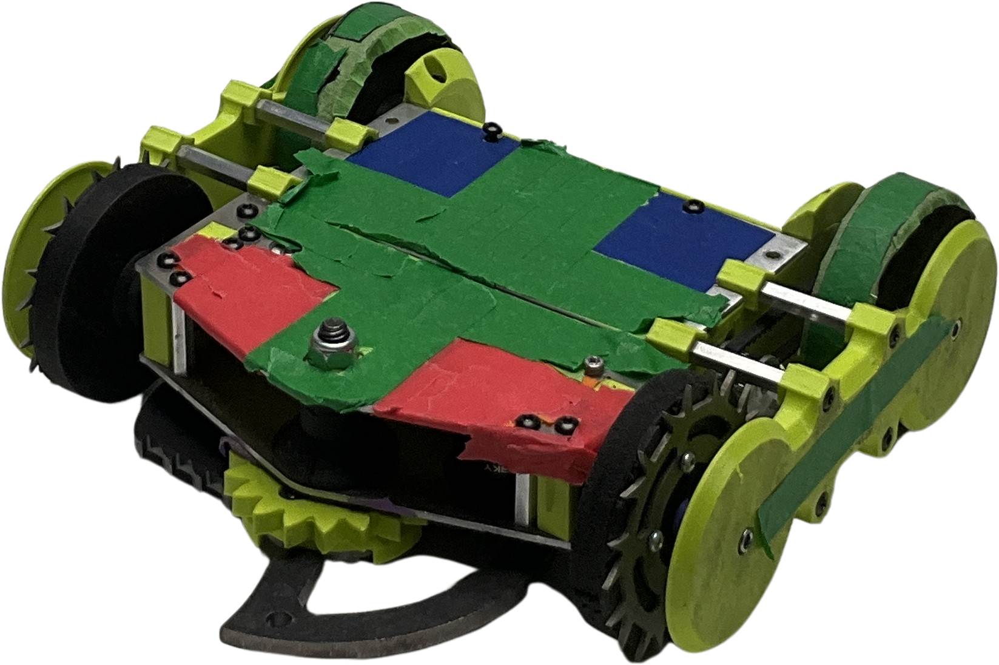

# Autonomous 25-26

Autonomous perception, decision-making, and control stack for Cornell Combat Robotics' robot **Huey**.

- Huey NHRL page: [https://www.nhrl.io/wiki/index.php/Huey](https://www.nhrl.io/wiki/index.php/Huey)


## What This Repository Does

This project takes a live camera feed (or test video), identifies robots in-frame, estimates Huey's orientation, computes movement commands with the RamRam algorithm, and can optionally transmit those commands to on-bot motor hardware.

At a high level:

1. Capture frame (`camera_stream.py` or OpenCV video source)
2. Warp frame into arena coordinates (homography)
3. Run object detection (`machine/predict.py`, YOLO via Ultralytics)
4. Quantize Huey colors for robust corner localization (`color_quant/quantization.py`)
5. Estimate robot corners and heading (`corner_detection/`)
6. Compute steering and speed (`Algorithm/ram.py`)
7. Optionally transmit commands to Arduino/FlySky pipeline (`transmission/`)
8. Display overlays and runtime diagnostics (`main_helpers.py`, `runtimesheet/`)

## Main Entry Point

- Run: `main.py`
- Core runtime settings are near the top of `main.py`:
  - `MODE`: `"comp"`, `"live"`, `"video"`, or `"custom"`
  - `MODEL_NAME` and `OD_IMG_SIZE`
  - `IS_TRANSMITTING`, `WEAPON_ON`, display toggles
  - `WARP_AND_COLOR_PICKING` (new calibration vs saved calibration)

## Processing Pipeline Details

`main.py` uses a dual-loop architecture:

- **Background perception thread**
  - Reads frames
  - Warps to precomputed map (`warp_main.py`)
  - Detects robots using a selected model backend:
    - TensorRT (NVIDIA)
    - CoreML (Apple Silicon)
    - OpenVINO (Intel)
    - ONNX CPU fallback
  - Quantizes colors for Huey-specific corner features
  - Runs corner detection and algorithm output (`speed`, `turn`)
  - Sends serial motor commands when transmission is enabled
  - Publishes display-ready frames

- **Main UI thread**
  - Handles keyboard input
  - Shows annotated main feed + optional quantized Huey crop
  - Synchronizes pause/step/flip/weapon state with the perception thread

## Repository Layout

- `main.py` - full integration runtime
- `main_helpers.py` - setup helpers, model/backend selection, display helpers
- `camera_stream.py` - threaded camera capture optimized for low latency
- `Algorithm/` - RamRam behavior logic, tests, and analysis utilities
- `corner_detection/` - color picking and orientation extraction
- `color_quant/` - color quantization utilities for robust feature isolation
- `machine/` - model loading/prediction wrappers + model artifacts
- `transmission/` - serial + motor control integration
- `runtimesheet/` - per-iteration timing export and graph generation
- `testing/` - test images and supporting scripts
- `main_files/` - videos, homography matrix, color selections, etc.

## Setup

### 1) Prerequisites

- Python **3.13.12** (as noted in `requirements.txt`)
- OS with OpenCV GUI support (macOS/Windows/Linux)
- Optional hardware:
  - USB camera (or capture card)
  - Arduino Nano + FlySky trainer-mode setup (for transmission)

### 2) Create and activate a virtual environment

macOS/Linux:

```bash
python3 -m venv .venv
source .venv/bin/activate
```

Windows (PowerShell):

```powershell
python -m venv .venv
.venv\Scripts\Activate.ps1
```

### 3) Install Python dependencies

```bash
pip install --upgrade pip
pip install -r requirements.txt
```

Notes:
- The project uses `ultralytics`, `torch`, `opencv-python`, `openvino`, and `pyserial`.
- Some optional graph outputs in `runtimesheet/` use Plotly.

### 4) Confirm model files exist

Models are expected under:

`machine/models/<MODEL_NAME>/<OD_IMG_SIZE>/...`

Default in `main.py`:

- `MODEL_NAME = "Nano320Temp"`
- `OD_IMG_SIZE = 320`

If you change either value, verify matching model artifacts exist.

## First-Time Calibration

The runtime supports two approaches:

- **Reuse previous calibration (default)**  
  Reads:
  - `main_files/homography_matrix.txt`
  - `main_files/selected_colors.txt`

- **Collect new calibration**  
  Set `WARP_AND_COLOR_PICKING = True` in `main.py`, then:
  1. Capture key frame by pressing `0`
  2. Select arena reference points for homography
  3. Pick robot colors when prompted
  4. Files are saved for later runs

## Running

### Video mode (recommended for local testing)

1. In `main.py`, set:
   - `MODE = "video"`
   - `camera_number = "<path to video>"`
2. Run:

```bash
python main.py
```

### Live camera mode

1. Set:
   - `MODE = "live"`
   - camera source index/path
2. Run:

```bash
python main.py
```

### Competition mode (transmission enabled)

1. Set:
   - `MODE = "comp"`
   - correct motor channel values
2. Ensure Arduino/FlySky hardware is configured (see `transmission/README.md`)
3. Run:

```bash
python main.py
```

## Keyboard Controls During Runtime

- `q` - quit
- `f` - flip control direction
- `p` - pause/resume playback
- `w` - toggle weapon state
- any other key while paused - step one frame

## Runtime Outputs

- `runtimesheet/itertimes.xlsx` - per-iteration timings
- `runtimesheet/itertimes.png` and `.svg` - timing plots
- `runtimesheet/itertimes_stacked.png` and `.svg` - stacked timing plots
- `color_output.csv` - corner detection color-percentage debug output

## Module-Specific Docs

- `Algorithm/README.md`
- `corner_detection/README.md`
- `transmission/README.md`
- `sensors/README.md`
- `vid_and_img_processing/README.md`

## Troubleshooting

- **No detections or wrong detections**
  - Verify correct `MODEL_NAME` / `OD_IMG_SIZE`
  - Re-run calibration (`WARP_AND_COLOR_PICKING = True`)
  - Check lighting and camera exposure

- **OpenCV window or camera issues**
  - Try different camera index or backend
  - Confirm camera permissions in OS settings

- **Serial/transmission errors**
  - Confirm Arduino is connected and flashed
  - Verify correct serial port and baudrate
  - Test with scripts in `transmission/`

- **Performance too low**
  - Use a smaller model/image size
  - Disable optional displays (`SHOW_QUANTIZED_HUEY`, overlays)
  - Check runtime plots in `runtimesheet/` to find bottlenecks