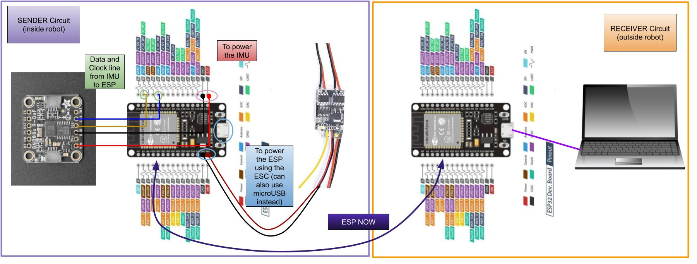

# Sensors

## Description
This code contains ESP to ESP communication, as well as a class that reads data from our IMU.

## Hardware Setup

## Software Setup

1. Create an `IMU_Sensor` object.
    - If you don't know what port the ESP is on, leave port as None (default) and respond to prompt in terminal when code is run

2. Use `sensor.get_yaw()` to retrieve the robot’s orientation.  
   - Returns a value between **0° and 360°**, representing the yaw angle.

3. Use `sensor.is_upside_down()` to determine the robot’s physical orientation.  
   - Returns **1** if the robot is upright.  
   - Returns **-1** if the robot is upside down.

